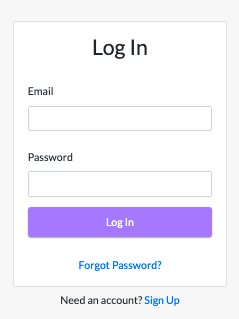
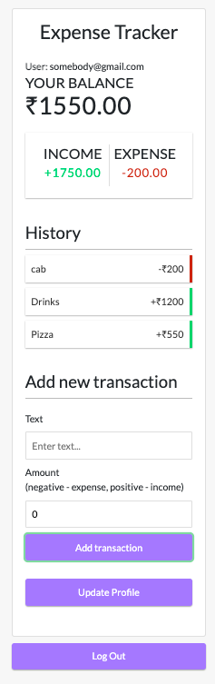

## Expense_Track
This is a basic expense tracker for Keeping a record of Personal daily expenses. Knowing how much we spent and the items we spent the money on enable us to manage and control our expenditure

  

  

## Deployed at 
https://expense-tracker-d4816.firebaseapp.com/login

## Installation and set-up
Fork the repository

-Run these commands on terminal-

git clone https://github.com/ShraxO1/Expense_Track.git

cd Expense_Track

npm install

